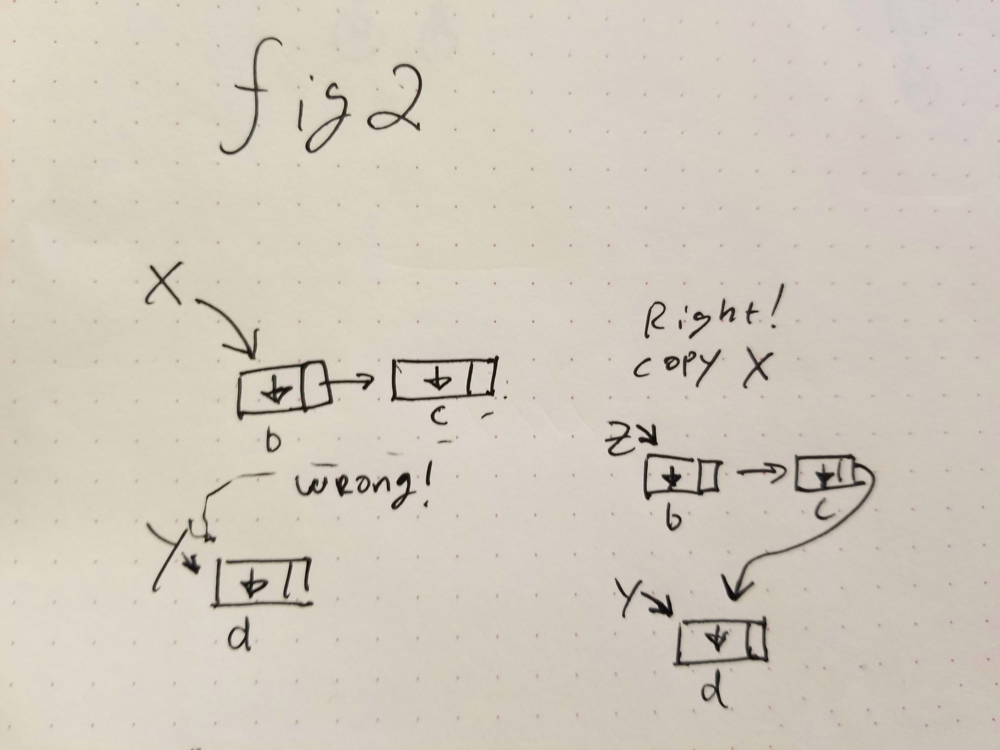
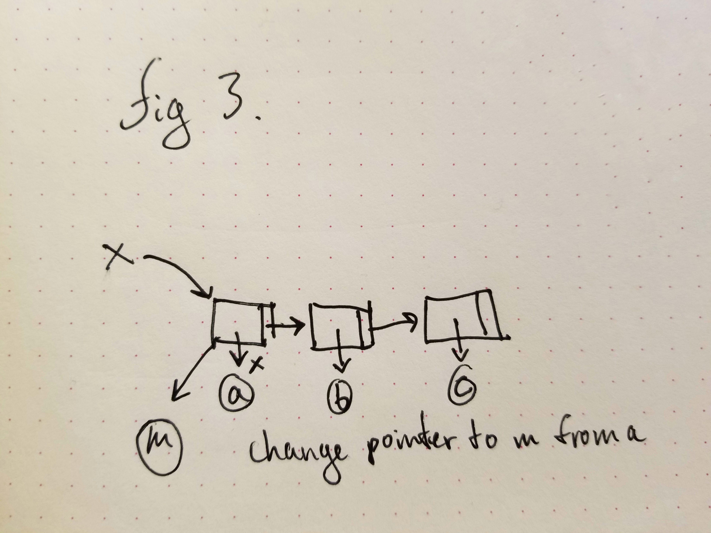
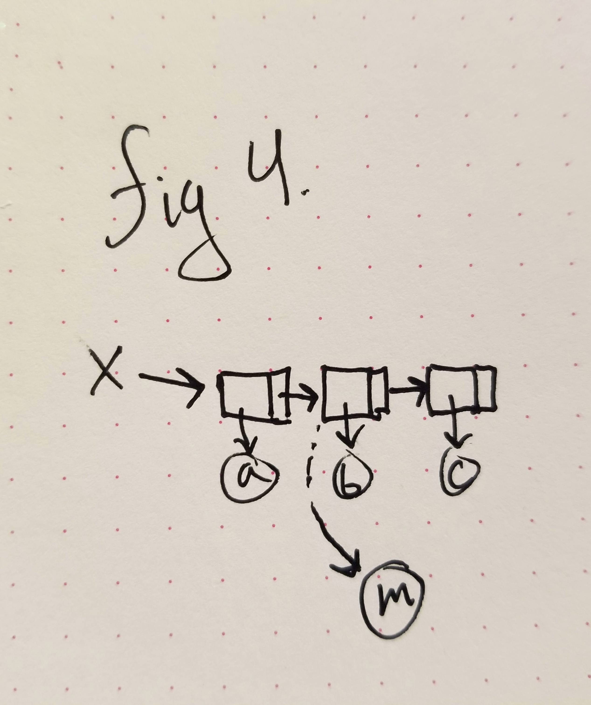
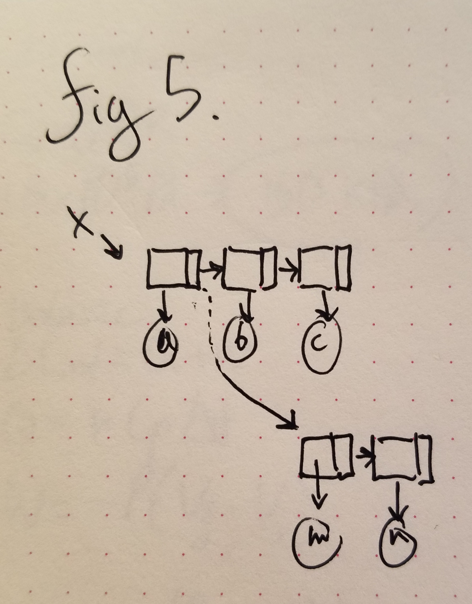

## 2020.02.13
### CS 326 @ UNR

## Course Outline
* General issues in the design and implementation of Programming Languages:
  - Syntax  _covered_
  - Names, scopes, bindings
  - Control Flow (loops, conditionals)
  - data types
  - subroutines
* Specific issues to some Programming Languages
  - data abstraction _(object oriented lang.)_
  - non-Imperative Programming models
    - functional logic _covered_
  - concurrency

yay.jpg

Ask for every function: What I should return? (Recursion)


## Trees (representation)

() &rightarrow; null

(value (...) (...* ))  * some of the time

Three functions for trees:
- Returns the value in the root.
- Left auxiliary function &rightarrow; returns the left tree.
- Right auxiliary function &rightarrow; returns the right tree.


## Sequencing
```C++

```
* begin

```Scheme
(begin <expr>...<expr>)
/* evaluates all expr. and returns the rightmost expr.'s result */

/* similar to */
(if (< x 0)
    (begin
      (display "Negative") /* then part */
      (f x))
    (begin
        (display "positive") /* else part */
        (g x)))    

(define x 1)
(+ x 1)     /* => 2 */
x           /* => 1 */
```

#### Side Effect
_definition_
>any no returning code that reached outside of your code or modifies global variables

#### Programming without side effects
_important for functional programming_
```Scheme
(define y `(1 2 3))
(reverse y)   /* => (3 2 1) */
y             /* => (1 2 3) */
```

Scheme notes:
- functions compute a result based on input and return it.
- They do not alter their input.

#### Scheme Side effects
`(define x y)` _Define has a side effect of binding x to value_

`(display)`

## Imperative Features
### internal structure of expressions
* All variables are pointers bound values
  - Atom values
    - (define x 1)    x &rightarrow; 1
  - List values
    - (define y `(1 2 3)) y &rightarrow; SCAN#1`


Each element in a list is a cons cell containing:
- pointer to value
- pointer to next (cons cell)
```Scheme
(define x `(b c))       /* fig 2 */
(define y `(d))
(define z (append x y))
/*  BAD IDEA: Functions are not supposed to alter their input.
    >x => (b c d)
    Duplicate x, then link y to x, and z points to the copy of x.
    The original list x is not altered. Yay!
    >z => (b c d)
    >x => (b c)
    >y => (d)*/
```

>implementation note:
If Y is Defined again, the POINTER y uses is deleted but not value, allowing for List Z to be stable. This is MEMORY MANAGMENT


### List Surgery
To alter the structure of a list:
- set-car!
  - changes the pointer to value in a cons cell
- set-cdr!
  - changes the pointer to next in a cons cell
_Note: exclamation mark after function names that alter their input._

Example 1:
Change the 1st element in a list:
```Scheme
(define x `(a b c))  /* see fig 3 */
>x   /* => (a b c) */

(set-car! x 'm)

>x   /* => (m b c) */
```


Example 2:
Change the second element in a list

```Scheme
(define x `(a b c)) /* see fig 4 */

(set-car! (cdr x) 'm) /* use for changing pointer to value */

>x   /* => (a m c) */
```

Example 3:
Change the list tail

```Scheme
(define x `(a b c))   /* see fig 5 */
x   /* => (a b c) */
(set-cdr! x `(m n))
>x /* => (a m n) */
```

_Note: (b c) goes to garbage collection because it has no active pointers to it.
This will be expanded upon later in the course._

Example 4:
Insert an element in the 2<sup>nd</sup> position
```Scheme
(define x `(a b c))
/* see fig 6 */
/*x => (a b c)*/
(set-cdr! x (cons `m (cdr x)))

/*x => (a m b c)*/
```

_Note: in the HW don't do Anything! I.E. using any var manipulation_

### Names, Bindings, scopes

* Name
  - _(exactly what you think it is)_
* Binding
  - _(an association between a name and the entity it names)_
* Scope
  - _(the part of the **program text** where a binding is active. specific to the binding and not the name)_

#### Naming:
Naming restrictions depend on the language.
- Example: @#$%^& is legal in Scheme but not C++.

Enforced vs good practice:

###### Hungarian notation:
Prefixing any camelCase Var with it's type shorthand
* szName
  - _(string terminated by zero)_
* bBooleanVar
  - _(boolean value)_
* fFloatVar
  - _(floating value)_
* m_iIntVar
  - _(member of data structure iIntVar)_
* OnMouseClick()
  - _(what you want to happen and then the name of the event)_


#### Binding Time:
Various decisions on binding are made at different time.
* Language design time
  - Naming related decisions here.
* Language implementation time
  - Handling of runtime exceptions.
* Program writing Time
  - Decisions of functions and variable definitions.
* Compile Time
  - Layout of static variables in static memory.
* Link time
  - Layout of entire program in memory.
* Load Time
  - When you execute the code. Loads program into memory.
* Run Time
  - Binding between actual variables and names.
  - Includes program module time, function entering time, exc.

#### Static vs. Dynamic
- Something that is happening before run time vs. something that is happening at run time.
  - Example, defining a variable before runtime or during runtime
- Static and dynamic binding times.
