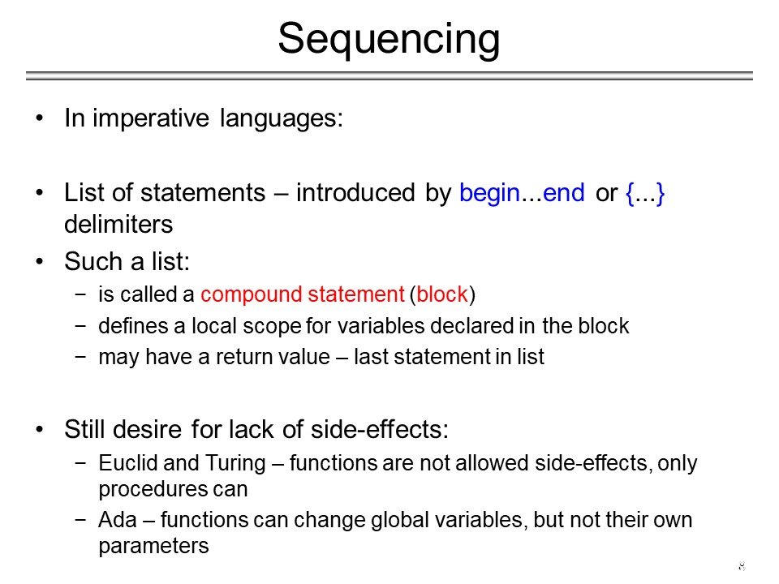
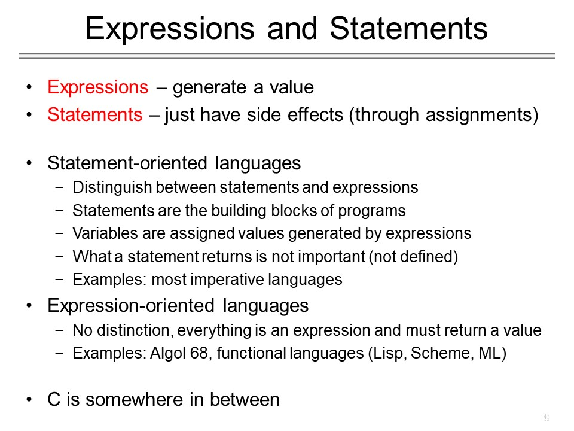
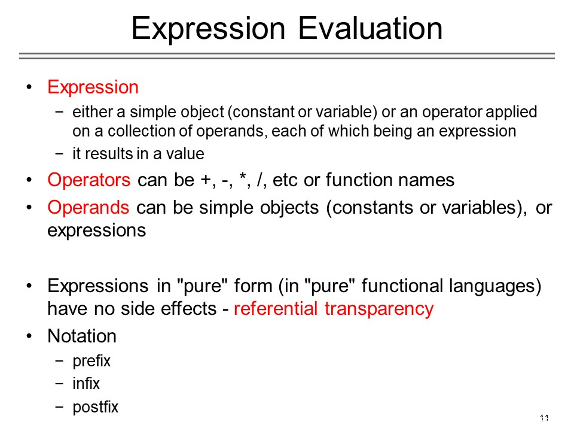
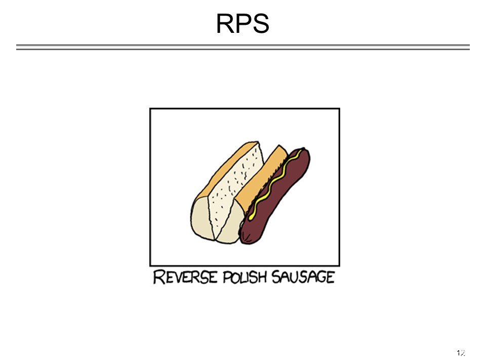

## 2020.02.25 <p> CS 326 @ UNR
### Josiah Everson <p> Nick Szewczak

<p>
*try to organize your code so that inputs act as indices in a table*<p>
<p>

There are only two hard problems in computer science: hash collisions, naming things, and off by one errors.
<p>
<p>
Direction of step is very important.
<p>


- Ambiguity
  - with what if does else associate?
```
if a = b then
  if c = d then
    statement 1
  else
    statement 2
```
- Pascal
  - disambiguation rule
    - else associates with the last unmatched if


### Back to board:


In general, "naïve" recursion is less efficient than iteration.
<p>*why? because all the jumps and pushing to stack is extra overhead*

There is an equally efficient method of recursion,

#### tail recursion:
https://en.wikipedia.org/wiki/Tail_call

Example: GCD
```Scheme
(define (gcd a b) ; tail recursive
  (cond
      ((= a b) a)
      ((< a b) (gcd a (- b a)))
    (else
      (gcd (- a b) b)
    )
  )
)
```
each recursive push to stack will add arguments and content on the stack <p>


- Function is tail recursive
  - No additional computation *after* the recursive call.
  - Returns what the recursive calls returns.
  - Can reuse the memory space of control activation for next one.
    - No stack manipulation.
  - if programmer is able to implement tail call format, the compiler
  - can treat the above code as:
>
```asm
gcd(a,b)

start:
  if a = b
    return a
  if a < b
    b = b-a
    goto start
  else
    a = a - b
    goto start
```
<p>

#### Ex:
$$\sum_{i=lo}^{hi} f(i)$$

```
<!-- not tail recursive -->
(define (sum f lo hi)
  (if (= lo hi)
    (f lo)
    (+ (f lo) (sum f (+ lo 1) hi))
  )
)
```

base case: if lo = hi
> s + f(lo)

*$$sum (f, lo, hi, s) = \Bigg\{s+f(lo) \quad \quad if lo = hi$$

$$  sum (f, lo, hi, s) =
    \level
      s+f(lo) \quad \quad if lo = hi
    \
      sum (f, lo + 1, hi, s + f(lo)) \quad otherwise
$$* WILL WORK ON THIS LATER!

general case: else;
> sum (low +1, hi, s+f(lo))
```
<!-- tail variant -->

```
