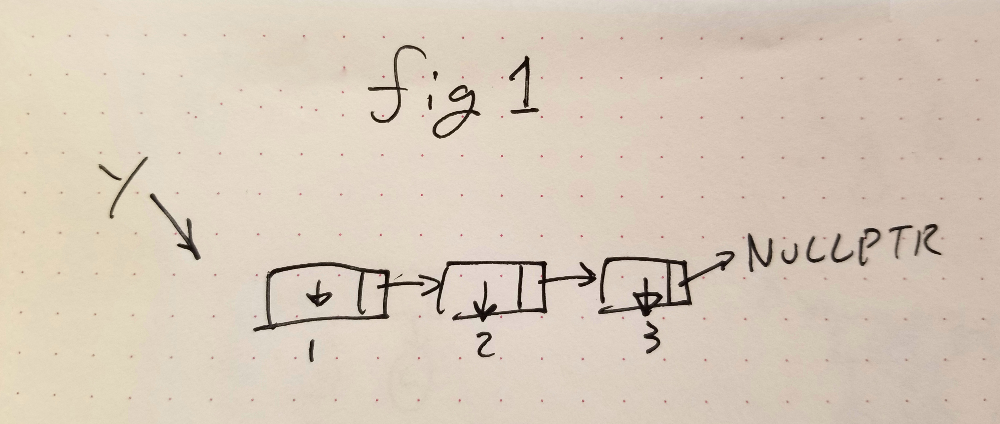

## 2020 02 18
### CS 326 @ UNR

Bindings can be
  - static binding: bindings made before runtime (early binding)
    - Main advantages of static binding. Efficiency &rightarrow; because only once
  - dynamic binding: bindings made at runtime (late binding)
    - Flexibility &rightarrow; based on input

#### Alocation:
object lifetime and binding lifetime (maybe be distinct)

Key events:
- creation of objects
  - allocation
- creation of bindings
  - declaration
- reference to a name
  - using a name in an expr. `ex. f(x);`
- temporary deactivation/reactivation of bindings
  - entering/leaving a local scope, for global vars hidden by local ones with the same name <p>> ex. local var inside a func

- destruction of Bindings
  - happens upon leaving a local scope `local vars`, end of program `global vars`
- destruction of objects
  - deallocation

```C
int x;        // destruction of binding: end of program run
void f()      // alocation of void f() and float x;
{
  float x;
}
```
Lifetime
>time between creation and destruction

- objects and bindings have distinct lifetimes
  - if an object outlives its only binding
      - (garbage, memory leak)

```c
p = new int;
p = null;
```

- If a binding outlives its object:
  - (dangling [pointer|refrence])

```c
p = new int;
r = p;
delete r;
int x = *p;   // <-- CRASH
```

#### Storage Management- Allocation

- Allocation
  - free block is available to use, is used
- Deallocation
  - block is put back, no longer used

Storage allocation mechanisms:
- static
  - lasts lifetime of the program
  - given an address before execution begins
    - retains address throughout execution
    - (ex. global variables, program code, explicit constants)
  -
### dynamic
- stack alloc
  - objects are allocated on a stack
    - bindings are made when entering a local scope
    - ex: entering method/function
  - local vars, return val, return address, funct args
### heap
- explicit alloc
  - `new int`, malloc,...
  - on a heap
  - principle concerns: speed, space
    - space issues<p>
    <p>
      - internal fragmentation
      - external fragmentation
        - locations of explicit heaps, how contigious you are.
        - solved by defragmentation
          - RISKS of defragmentation
            - update all pointers in blocks and pointing to blocks
        >jump down to see implementation

- implicit alloc
  - alloc is transparent for the programmer
  -
```scheme
; implicit creation of list datatype (of pairs/pairs)
(define L '(1 2 3))
```
See example:


#### fortran 77
- static alloc for items inside a subroutine
  
- Advantages:
  - avoids runtime stack manipulation
  - history-sensitive local variables
    - retain values between calls to the same function

- Disadvantages:
  - waste of (static) space
    - all local items for all functions stay allocated at all times
  - prohibits recursion
    - since you can not copy the args
    - can not have  A &rightarrow; A or A &rightarrow; B &rightarrow; A

Maintenance of the stack:
- calling sequence
  - code executed by the caller immediately before and after the call
- subroutine prologue and epilogue
  - code executed by the callee at its beginning and its end

For simple stuff, use a macro to avoid a stack manipulation.
```c
#define max(x, y) x > y ? x:y // faster

int max(int x, int y)         // slower
{
  return x > y ? x:y;
}
```

NOTE: Go back up the dynamic heap above! ^^^


### Dynamic heap alloc implementation
#### Maintain a single linked list of free blocks

Approaches:
- first fit:
  - selects the first block large enough to satisfy the request
  - tends to produce internal fragmentation
- best fit
  - selects smallest bock that is large enough to fit request
  - tends to take longer
- funky fit
  - separate lists of blocks of diff sizes
